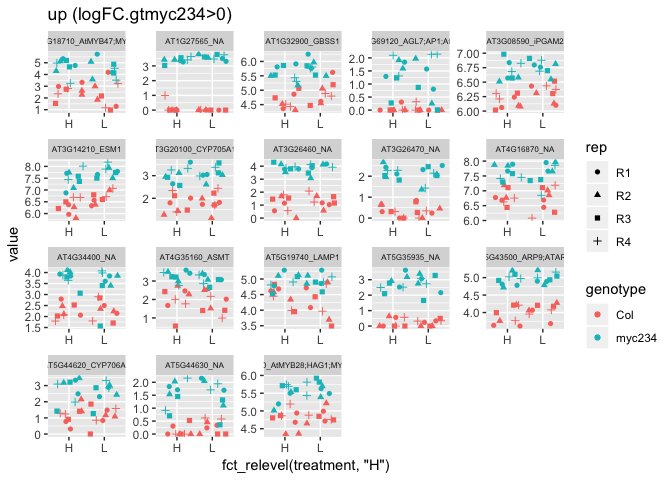
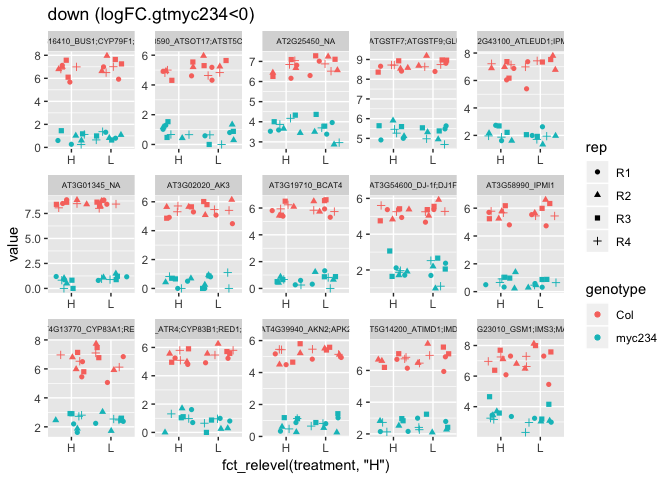

###package needed

```r
library(tidyverse)
```

```
## ── Attaching packages ───────────────────────────────────────────────────────────────── tidyverse 1.2.1 ──
```

```
## ✔ ggplot2 3.1.1       ✔ purrr   0.3.2  
## ✔ tibble  2.1.1       ✔ dplyr   0.8.0.1
## ✔ tidyr   0.8.3       ✔ stringr 1.4.0  
## ✔ readr   1.3.1       ✔ forcats 0.4.0
```

```
## Warning: package 'ggplot2' was built under R version 3.5.2
```

```
## Warning: package 'tibble' was built under R version 3.5.2
```

```
## Warning: package 'tidyr' was built under R version 3.5.2
```

```
## Warning: package 'purrr' was built under R version 3.5.2
```

```
## Warning: package 'dplyr' was built under R version 3.5.2
```

```
## Warning: package 'stringr' was built under R version 3.5.2
```

```
## Warning: package 'forcats' was built under R version 3.5.2
```

```
## ── Conflicts ──────────────────────────────────────────────────────────────────── tidyverse_conflicts() ──
## ✖ dplyr::filter() masks stats::filter()
## ✖ dplyr::lag()    masks stats::lag()
```

```r
library(ggdendro)
library(plotly)
```

```
## 
## Attaching package: 'plotly'
```

```
## The following object is masked from 'package:ggplot2':
## 
##     last_plot
```

```
## The following object is masked from 'package:stats':
## 
##     filter
```

```
## The following object is masked from 'package:graphics':
## 
##     layout
```

```r
library(edgeR)
```

```
## Loading required package: limma
```

```r
library(readxl)
```

```
## Warning: package 'readxl' was built under R version 3.5.2
```

```r
library(goseq) # goseq
```

```
## Loading required package: BiasedUrn
```

```
## Loading required package: geneLenDataBase
```

```
## 
```
# read custom category list

```r
#load("../input/At.hormone.responsive.list.Rdata")
# load custom categories
load(file.path("..","input","hormone.responsiveness6.DF.s.Rdata")) # using SAup_combined & SAdown_combined
#hormone.responsiveness6.DF.s %>% dplyr::select(PIFtarget)
#At.hormone.responsive.list<-read_xlsx(path=file.path("..","input","Supplemental_Dataset3_source_of_custom_categories.xlsx"),sheet=1,skip=15)
#At.hormone.responsive.list %>% dplyr::select(PIFtarget)
# from tpc120857_SupplementalTable1.pdf (Leivar and Monte, 2014)
PIFup<-c("AT5G39860","AT5G15160","AT4G16780","AT2G44910","AT5G47370","AT3G60390","AT1G18400","AT1G69010","AT1G03790","AT1G02340","AT1G14920","AT2G42870","AT2G46970","AT3G62090","AT2G43060","AT5G02200","AT2G37678","AT1G52830","AT1G04250","AT1G09570","AT4G28720","AT1G04180","AT1G70560","AT4G39950","AT4G27260","AT1G70940","AT3G14370","AT5G18010","AT4G37770","AT5G65800","AT1G02400","AT5G07010","AT5G07000","AT1G75450","AT4G10240","AT4G32280","AT3G15540","AT5G04190","AT4G25470")
PIFdown<-c("AT1G06040","AT5G44190","AT4G26150","AT5G56860","AT5G13630","AT1G70700","AT1G05010","AT5G67030","AT1G01060","AT2G46830")
PIFcomplex<-c("AT5G11260","AT5G02760")
At.PIFtarget.list<-list(PIFup=PIFup,PIFdown=PIFdown,PIFcomplex=PIFcomplex)
```
# convert into custom category list
# format At.PIFtarget.list2 into goseq() compatible list (run once)

```r
# extract AGI from At_cdna
At.gene.name<-tibble(name=names(At_cdna)) %>% separate(name,into=c("name2","Symbol","description"),sep=" \\|",extra="drop",fill="left") %>%  mutate(AGI=str_remove(name2,pattern="\\.[[:digit:]]+")) 
# make presence/absense hormone responsive gene table (dataframe)
  for(i in 1:3) {
  genes<-At.PIFtarget.list[[i]] %>% as_vector()
  temp<-data.frame(AGI=genes,category=names(At.PIFtarget.list)[i])
  #At.gene.name %>% left_join(temp,by=c("name"="AGI")) -> At.gene.name
At.gene.name %>% left_join(temp,by="AGI") -> At.gene.name 
  }
names(At.gene.name)[5:7] <- names(At.PIFtarget.list)
At.gene.name %>% filter(str_detect(AGI,pattern="AT1G|AT2G|AT3G|AT4G|AT5G|ATC|ATM")) %>% unite(category,5:7,sep=",")->test2
test2[1:10,] %>%  mutate(category=gsub("NA","",category)) %>% mutate(category=gsub(",","",category))
# only select genes with AGI name and concatenate categories
At.gene.name %>% filter(str_detect(AGI,pattern="AT1G|AT2G|AT3G|AT4G|AT5G|ATC|ATM")) %>% unite(category,5:7,sep=",") %>%  mutate(category=gsub("NA,","",category)) %>% mutate(category=gsub(",NA","",category)) %>% mutate(category=gsub("NA","",category)) ->test3
# convert into list object
temp.list<-list()
for(i in 1:dim(test3)[1]) {
  temp.list[[i]]<-test3 %>% slice(i) %>% pull(category)
}
names(temp.list)<-test3 %>% pull(AGI)
# split concatanated categories in each gene
At.PIFtarget.list2<-lapply(temp.list,function(x) unlist(strsplit(x, split=",")))
# save
save(At.PIFtarget.list2,file="..","output","At.PIFtarget.list2.Rdata")
```


# prep for GOseq with custom category

```r
 # bias.data vector must have the same length as DEgenes vector! 
getwd()
```

```
## [1] "/Volumes/data_work/Data8/NGS_related/Arabidopsis_analysis/SAS_defense_transcriptome_project/SAS_defense_transcriptome"
```

```r
At_cdna<-Biostrings::readDNAStringSet("https://www.arabidopsis.org/download_files/Sequences/TAIR10_blastsets/TAIR10_cdna_20110103_representative_gene_model_updated")
At_cdna
```

```
##   A DNAStringSet instance of length 33602
##         width seq                                      names               
##     [1]  2394 AGAAAACAGTCGACCGTCA...TTGGTAATTTTTTGAGTC AT1G50920.1 | Sym...
##     [2]   546 ATGACTCGTTTGTTGCCTT...GTTGATTCTGGTACATAG AT1G36960.1 | Sym...
##     [3]  2314 ATGGATTCAGAGTCAGAGT...GGTGCATTGTGTTTCTCC AT1G44020.1 | Sym...
##     [4]  1658 TCGTTTCGTCGTCGATCAG...GATTACATGCTACATTTT AT1G15970.1 | Sym...
##     [5]  1453 ATTGAAAAGAAAACACATC...CACCAAAATCTTCTCATA AT1G73440.1 | Sym...
##     ...   ... ...
## [33598]    87 GGATGGATGTCTGAGCGGT...CGAATCCCTCTCCATCCG ATMG00420.1 | Sym...
## [33599]   384 ATGCTCCCCGCCGGTTGTT...CGATACTTAACTATATAA ATMG01330.1 | Sym...
## [33600]   573 ATGGATAACCAATTCATTT...CAGCGTAGCGACGGATAA ATMG00070.1 | Sym...
## [33601]   366 ATGGCATCAAAAATCCGCA...CCTTCTGCATACGCATAA ATMG00130.1 | Sym...
## [33602]    74 GCGCTCTTAGTTCAGTTCG...CAAATCCTACAGAGCGTG ATMG00930.1 | Sym...
```

```r
## if you want to test expressed genes as background, add background in this function
load(file.path("..","output","At.PIFtarget.list2.Rdata"))
```

```
## Warning in readChar(con, 5L, useBytes = TRUE): cannot open compressed file
## '../output/At.PIFtarget.list2.Rdata', probable reason 'No such file or
## directory'
```

```
## Error in readChar(con, 5L, useBytes = TRUE): cannot open the connection
```

```r
GOseq.At.customcat.ORA<-function(genelist,padjust=0.05,custom.category.list=At.hormone.responsive.list,cdna=At_cdna,background="") { # return GO enrichment table, padjus, padjust=0.05. New BLAST2GO results with only BP Brgo.v2.5.BP.list is used (042518). Brgo.v2.5.BP.list is based on Hajar's Blast2go, which should be replaced with Brgo.Atgoslim.BP.list and giving a new name to this function (080818). cdna is DNAstring object. background is a vector of genes.
  #bias<-nchar(cdna)
  bias<-Biostrings::width(cdna)
  # add name to "bias". cdna
  #names(bias)<-names(cdna)
 names(bias) <- tibble(name=names(cdna)) %>% separate(name,into=c("name2","Symbol","description"),sep=" \\|",extra="drop",fill="left") %>%  mutate(AGI=gsub(pattern="\\.[[:digit:]]+", "", name2)) %>% pull(AGI)
 if(background=="") {print("Use all genes in genome as background")} else {
 # select only expressed geens 
  bias <- bias[background$gene_id]
  print("Expessed genes are used as background.")
  print(paste("length of bias is ",length(bias)))
 }
  TF<-(names(bias) %in% genelist)*1
  names(TF)<-names(bias)
  #print(TF)
  pwf<-nullp(TF,bias.data=bias)
  #print(pwf$DEgenes)
  GO.pval <- goseq(pwf,gene2cat=custom.category.list,use_genes_without_cat=TRUE) # format became different in new goseq version (021111). Does not work (042716)
  # calculate p ajust by BH
  GO.pval$over_represented_padjust<-p.adjust(GO.pval$over_represented_pvalue,method="BH")
  if(GO.pval$over_represented_padjust[1]>padjust) return("no enriched GO")
  else {
    enriched.GO<-GO.pval[GO.pval$over_represented_padjust<padjust,] 
    print("enriched.GO is")
    print(enriched.GO)
    return(enriched.GO)
  }
}
```

# Importing enrichment result table and have summary table: Table of DEGs (under construction)

```r
# Ding (2018) Cell DEGs
list.files(path=file.path("..","output","DEGs_with_description"),pattern=".csv") # finding files in different blogs did not work.. Did work this time... why?
```

```
##  [1] "DEgenes.Col.1h.rH.csv"          "DEgenes.Col.49h.rH.csv"        
##  [3] "DEgenes.myc234.1h.rCol.rH.csv"  "DEgenes.myc234.1h.rH.csv"      
##  [5] "DEgenes.myc234.49h.rCol.rH.csv" "DEgenes.myc234.49h.rH.csv"     
##  [7] "DEgenes.npr.1h.rCol.rH.csv"     "DEgenes.npr.1h.rH.csv"         
##  [9] "DEgenes.npr.49h.rCol.rH.csv"    "DEgenes.npr.49h.rH.csv"        
## [11] "DEgenes.sid.1h.rCol.rH.csv"     "DEgenes.sid.1h.rH.csv"         
## [13] "DEgenes.sid.49h.rCol.rH.csv"    "DEgenes.sid.49h.rH.csv"
```

```r
getwd()
```

```
## [1] "/Volumes/data_work/Data8/NGS_related/Arabidopsis_analysis/SAS_defense_transcriptome_project/SAS_defense_transcriptome"
```

```r
DEG.objs<-list.files(path=file.path("..","output","DEGs_with_description"),pattern="\\.csv$") # under construction
DEG.objs
```

```
##  [1] "DEgenes.Col.1h.rH.csv"          "DEgenes.Col.49h.rH.csv"        
##  [3] "DEgenes.myc234.1h.rCol.rH.csv"  "DEgenes.myc234.1h.rH.csv"      
##  [5] "DEgenes.myc234.49h.rCol.rH.csv" "DEgenes.myc234.49h.rH.csv"     
##  [7] "DEgenes.npr.1h.rCol.rH.csv"     "DEgenes.npr.1h.rH.csv"         
##  [9] "DEgenes.npr.49h.rCol.rH.csv"    "DEgenes.npr.49h.rH.csv"        
## [11] "DEgenes.sid.1h.rCol.rH.csv"     "DEgenes.sid.1h.rH.csv"         
## [13] "DEgenes.sid.49h.rCol.rH.csv"    "DEgenes.sid.49h.rH.csv"
```

```r
# read csv file
DEG.list<-lapply(DEG.objs, function(x) read_csv(paste(file.path("..","output","DEGs_with_description"),"/",x,sep="")))
```

```
## Warning: Missing column names filled in: 'X1' [1]

## Warning: Missing column names filled in: 'X1' [1]

## Warning: Missing column names filled in: 'X1' [1]

## Warning: Missing column names filled in: 'X1' [1]

## Warning: Missing column names filled in: 'X1' [1]

## Warning: Missing column names filled in: 'X1' [1]

## Warning: Missing column names filled in: 'X1' [1]

## Warning: Missing column names filled in: 'X1' [1]

## Warning: Missing column names filled in: 'X1' [1]

## Warning: Missing column names filled in: 'X1' [1]

## Warning: Missing column names filled in: 'X1' [1]

## Warning: Missing column names filled in: 'X1' [1]

## Warning: Missing column names filled in: 'X1' [1]

## Warning: Missing column names filled in: 'X1' [1]
```

```r
names(DEG.list)<-gsub(".csv","",DEG.objs)
DEG.list
```

```
## $DEgenes.Col.1h.rH
## # A tibble: 151 x 9
##       X1 gene_id   logFC logCPM    LR   PValue      FDR description   name 
##    <dbl> <chr>     <dbl>  <dbl> <dbl>    <dbl>    <dbl> <chr>         <chr>
##  1     1 AT3G154… -1.40    5.34  87.1 1.01e-20 1.75e-16 Aluminium in… <NA> 
##  2     2 AT1G809… -1.13    4.75  61.7 3.95e-15 3.42e-11 Chaperone Dn… AtJ8…
##  3     3 AT5G202… -1.48    4.87  60.8 6.17e-15 3.56e-11 Raffinose sy… DIN1…
##  4     4 AT4G376… -2.32    2.56  60.0 9.45e-15 3.87e-11 BTB and TAZ … BT5  
##  5     5 AT2G158… -0.947   6.05  59.7 1.12e-14 3.87e-11 maternal eff… CBP1…
##  6     6 AT2G076…  4.20    3.16  58.0 2.64e-14 7.64e-11 Cytochrome c… <NA> 
##  7     7 AT4G398…  0.892   6.23  51.6 6.75e-13 1.67e- 9 myo-inositol… ATIP…
##  8     8 AT3G255…  6.69    1.09  47.7 4.86e-12 1.05e- 8 Adenosylmeth… SAMD…
##  9     9 AT1G050… -6.92    1.25  47.2 6.31e-12 1.14e- 8 dentin sialo… <NA> 
## 10    10 AT3G100… -1.00    6.36  47.1 6.59e-12 1.14e- 8 unknown prot… <NA> 
## # … with 141 more rows
## 
## $DEgenes.Col.49h.rH
## # A tibble: 196 x 9
##       X1 gene_id   logFC logCPM    LR   PValue      FDR description   name 
##    <dbl> <chr>     <dbl>  <dbl> <dbl>    <dbl>    <dbl> <chr>         <chr>
##  1     1 AT2G106… -4.80    2.30  89.8 2.66e-21 4.61e-17 transposable… <NA> 
##  2     2 AT5G139…  0.961   6.60  51.8 6.03e-13 5.23e- 9 Chalcone and… ATCH…
##  3     3 AT3G154… -0.950   5.31  43.9 3.51e-11 2.03e- 7 Aluminium in… <NA> 
##  4     4 AT1G757…  1.60    3.42  40.4 2.08e-10 9.01e- 7 GAST1 protei… GASA1
##  5     5 AT1G268… -1.16    4.08  38.5 5.59e-10 1.94e- 6 RING/U-box s… MPSR1
##  6     6 ATCG002… -0.885   7.91  36.9 1.26e- 9 3.65e- 6 photosystem … PSBD 
##  7     7 AT5G541… -1.27    3.63  36.4 1.58e- 9 3.90e- 6 protochlorop… PORA 
##  8     8 AT5G428…  1.68    3.65  35.6 2.41e- 9 5.23e- 6 dihydroflavo… DFR;…
##  9     9 AT5G523… -0.775   6.58  34.2 4.91e- 9 9.45e- 6 low-temperat… COR7…
## 10    10 AT2G425… -0.932   6.89  32.6 1.16e- 8 1.86e- 5 cold regulat… COR1…
## # … with 186 more rows
## 
## $DEgenes.myc234.1h.rCol.rH
## # A tibble: 518 x 10
##       X1 gene_id logFC.gtmyc234 logFC.gtmyc234.… logCPM    LR    PValue
##    <dbl> <chr>            <dbl>            <dbl>  <dbl> <dbl>     <dbl>
##  1     1 AT3G01…         -10.2            1.58     6.74 3576. 0.       
##  2     2 AT4G31…          -5.32          -1.47     4.68  732. 1.36e-159
##  3     3 AT1G16…          -6.48           0.0320   6.06  604. 6.61e-132
##  4     4 AT2G30…          -3.27          -0.153    8.29  585. 9.95e-128
##  5     5 AT3G19…          -6.71           0.480    5.49  559. 3.40e-122
##  6     6 AT3G02…          -6.24          -0.813    4.88  528. 1.73e-115
##  7     7 AT3G58…          -5.35          -0.883    5.03  488. 8.73e-107
##  8     8 AT5G14…          -4.21           0.161    6.08  454. 2.63e- 99
##  9     9 AT4G39…          -5.15          -0.199    4.76  424. 9.44e- 93
## 10    10 AT2G43…          -4.98          -0.443    6.16  418. 1.98e- 91
## # … with 508 more rows, and 3 more variables: FDR <dbl>,
## #   description <chr>, name <chr>
## 
## $DEgenes.myc234.1h.rH
## # A tibble: 75 x 9
##       X1 gene_id   logFC logCPM    LR   PValue      FDR description   name 
##    <dbl> <chr>     <dbl>  <dbl> <dbl>    <dbl>    <dbl> <chr>         <chr>
##  1     1 AT3G154… -1.19   5.06   76.4 2.30e-18 3.99e-14 Aluminium in… <NA> 
##  2     2 AT1G233… -0.972  6.68   72.4 1.72e-17 1.49e-13 Kelch repeat… KFB  
##  3     3 AT5G493… -0.923  4.88   54.1 1.94e-13 1.12e- 9 beta-xylosid… ATBX…
##  4     4 AT5G202… -1.13   4.26   48.3 3.69e-12 1.60e- 8 Raffinose sy… DIN1…
##  5     5 AT2G158… -0.831  5.10   41.2 1.39e-10 4.80e- 7 Leucine-rich… LRX10
##  6     6 AT5G219… -1.15   3.76   40.3 2.21e-10 6.38e- 7 unknown prot… <NA> 
##  7     7 AT5G615… -0.953  4.27   39.7 2.92e-10 7.23e- 7 Integrase-ty… DEWA…
##  8     8 AT2G259… -0.530  7.38   36.7 1.41e- 9 3.06e- 6 Zinc finger … ATCT…
##  9     9 AT4G109…  5.84   0.544  33.4 7.49e- 9 1.27e- 5 UDP-D-glucos… UGE5 
## 10    10 AT2G158… -0.739  5.75   33.3 7.73e- 9 1.27e- 5 maternal eff… CBP1…
## # … with 65 more rows
## 
## $DEgenes.myc234.49h.rCol.rH
## # A tibble: 893 x 10
##       X1 gene_id logFC.gtmyc234 logFC.gtmyc234.… logCPM    LR    PValue
##    <dbl> <chr>            <dbl>            <dbl>  <dbl> <dbl>     <dbl>
##  1     1 AT3G01…          -8.38           0.449    6.28 4591. 0.       
##  2     2 AT1G16…          -7.63          -0.0606   6.85 1179. 1.09e-256
##  3     3 AT2G43…          -5.17          -0.612    6.88 1160. 1.02e-252
##  4     4 AT5G23…          -4.02          -1.00     7.05 1015. 4.02e-221
##  5     5 AT3G19…          -7.23           0.661    5.75  982. 7.28e-214
##  6     6 AT5G14…          -4.40          -0.659    6.63  921. 1.01e-200
##  7     7 AT4G13…          -4.49          -0.486    6.63  877. 4.37e-191
##  8     8 AT2G30…          -3.26          -0.454    8.47  855. 2.28e-186
##  9     9 AT3G02…          -6.70           0.620    5.18  824. 1.22e-179
## 10    10 AT3G58…          -6.73          -0.496    5.52  723. 9.17e-158
## # … with 883 more rows, and 3 more variables: FDR <dbl>,
## #   description <chr>, name <chr>
## 
## $DEgenes.myc234.49h.rH
## # A tibble: 195 x 9
##       X1 gene_id   logFC logCPM    LR   PValue      FDR description   name 
##    <dbl> <chr>     <dbl>  <dbl> <dbl>    <dbl>    <dbl> <chr>         <chr>
##  1     1 AT5G366… -8.17   2.07  124.  7.49e-29 1.30e-24 RING/FYVE/PH… <NA> 
##  2     2 AT1G299… -4.86   1.98   86.8 1.22e-20 1.06e-16 conserved pe… <NA> 
##  3     3 AT1G233… -0.705  6.92   75.1 4.47e-18 2.58e-14 Kelch repeat… KFB  
##  4     4 AT5G404… -0.613  8.26   57.3 3.71e-14 1.61e-10 unknown prot… RBB1 
##  5     5 AT3G100… -0.632  6.19   47.3 6.07e-12 2.10e- 8 unknown prot… <NA> 
##  6     6 AT5G139…  0.831  6.52   45.6 1.46e-11 4.21e- 8 Chalcone and… ATCH…
##  7     7 AT5G505… -6.76   0.838  44.1 3.10e-11 7.67e- 8 SUMO-activat… AT-S…
##  8     8 AT4G109… -6.70   0.832  43.6 3.95e-11 8.56e- 8 UDP-D-glucos… UGE5 
##  9     9 AT5G497… -0.557  7.26   42.8 6.21e-11 1.20e- 7 ferric reduc… ATFR…
## 10    10 AT1G180… -6.71   0.867  42.1 8.81e-11 1.53e- 7 Major facili… <NA> 
## # … with 185 more rows
## 
## $DEgenes.npr.1h.rCol.rH
## # A tibble: 1,581 x 10
##       X1 gene_id logFC.gtnpr logFC.gtnpr.trtL logCPM    LR    PValue
##    <dbl> <chr>         <dbl>            <dbl>  <dbl> <dbl>     <dbl>
##  1     1 AT2G48…       -7.06          -0.900    6.02 1531. 0.       
##  2     2 AT3G01…       -6.58          -1.56     6.74 2983. 0.       
##  3     3 AT3G42…        8.22           0.156    4.29 1100. 1.20e-239
##  4     4 AT1G63…       -1.70          -0.0279   7.26  514. 3.02e-112
##  5     5 AT5G35…        6.95          -0.990    2.67  454. 2.28e- 99
##  6     6 AT3G55…       -7.02           0.132    3.38  428. 1.28e- 93
##  7     7 AT1G53…       -3.04           0.253    5.26  332. 6.64e- 73
##  8     8 AT5G46…        2.71           0.373    3.75  306. 3.11e- 67
##  9     9 AT5G28…        6.43           0.954    2.33  253. 9.21e- 56
## 10    10 AT1G18…        2.76          -0.245    4.90  238. 1.66e- 52
## # … with 1,571 more rows, and 3 more variables: FDR <dbl>,
## #   description <chr>, name <chr>
## 
## $DEgenes.npr.1h.rH
## # A tibble: 60 x 9
##       X1 gene_id   logFC logCPM    LR   PValue      FDR description   name 
##    <dbl> <chr>     <dbl>  <dbl> <dbl>    <dbl>    <dbl> <chr>         <chr>
##  1     1 ATCG010…  2.35    3.52  74.5 6.18e-18 1.07e-13 NADH:ubiquin… NDHG 
##  2     2 ATCG010…  1.74    4.49  56.9 4.69e-14 4.07e-10 NADH-Ubiquin… NDHD 
##  3     3 AT1G233… -1.07    5.82  54.1 1.90e-13 1.10e- 9 Kelch repeat… KFB  
##  4     4 AT2G076…  2.02    3.30  45.8 1.32e-11 5.70e- 8 Cytochrome c… <NA> 
##  5     5 AT2G158… -1.51    4.90  41.5 1.19e-10 4.12e- 7 Leucine-rich… LRX10
##  6     6 AT5G229… -1.30    4.29  39.6 3.19e-10 9.20e- 7 CHY-type/CTC… AtRZ…
##  7     7 AT5G247…  1.03    4.88  35.9 2.06e- 9 4.92e- 6 vegetative s… ATVS…
##  8     8 AT5G202… -1.36    4.25  35.7 2.27e- 9 4.92e- 6 Raffinose sy… DIN1…
##  9     9 AT3G154… -1.56    5.19  33.9 5.71e- 9 1.10e- 5 Aluminium in… <NA> 
## 10    10 AT3G197…  0.767   6.03  31.3 2.19e- 8 3.49e- 5 branched-cha… BCAT4
## # … with 50 more rows
## 
## $DEgenes.npr.49h.rCol.rH
## # A tibble: 2,904 x 10
##       X1 gene_id logFC.gtnpr logFC.gtnpr.trtL logCPM    LR    PValue
##    <dbl> <chr>         <dbl>            <dbl>  <dbl> <dbl>     <dbl>
##  1     1 AT3G01…       -7.52           0.863    6.28 4092. 0.       
##  2     2 AT2G48…       -7.06           1.12     5.99 2573. 0.       
##  3     3 AT3G42…        6.84           4.01     3.82 1027. 1.03e-223
##  4     4 AT1G63…       -1.78          -0.410    7.12  728. 9.82e-159
##  5     5 AT1G53…       -3.86           1.80     4.76  449. 2.84e- 98
##  6     6 AT3G55…       -5.74          -0.542    3.18  392. 9.31e- 86
##  7     7 AT3G14…        1.57          -0.0471   7.71  316. 2.75e- 69
##  8     8 AT5G35…        5.77           0.893    2.62  245. 7.38e- 54
##  9     9 AT5G15…        2.49           0.501    3.62  212. 1.15e- 46
## 10    10 AT5G46…        2.76          -0.424    3.69  196. 2.15e- 43
## # … with 2,894 more rows, and 3 more variables: FDR <dbl>,
## #   description <chr>, name <chr>
## 
## $DEgenes.npr.49h.rH
## # A tibble: 69 x 9
##       X1 gene_id   logFC logCPM    LR   PValue      FDR description   name 
##    <dbl> <chr>     <dbl>  <dbl> <dbl>    <dbl>    <dbl> <chr>         <chr>
##  1     1 AT5G506…  7.56   1.68   71.6 2.67e-17 4.63e-13 Major facili… <NA> 
##  2     2 AT2G400…  5.66   2.19   63.8 1.41e-15 1.22e-11 unknown prot… <NA> 
##  3     3 AT2G052… -3.11   2.82   49.9 1.64e-12 9.49e- 9 DNAJ heat sh… <NA> 
##  4     4 AT2G431…  0.807  7.40   47.4 5.83e-12 2.52e- 8 isopropylmal… ATLE…
##  5     5 AT1G233… -0.943  6.29   31.2 2.37e- 8 8.21e- 5 Kelch repeat… KFB  
##  6     6 AT1G056… -1.55   3.50   29.9 4.47e- 8 1.12e- 4 Uridine diph… UGT7…
##  7     7 AT5G078… -3.62   1.90   29.9 4.51e- 8 1.12e- 4 conserved pe… <NA> 
##  8     8 AT1G136… -0.747  6.53   29.4 5.83e- 8 1.21e- 4 BEST Arabido… <NA> 
##  9     9 AT5G148…  3.67   0.952  29.3 6.30e- 8 1.21e- 4 transposable… <NA> 
## 10    10 AT5G159…  2.25   2.05   28.5 9.24e- 8 1.60e- 4 Adenosylmeth… SAMD…
## # … with 59 more rows
## 
## $DEgenes.sid.1h.rCol.rH
## # A tibble: 25 x 10
##       X1 gene_id logFC.gtsid logFC.gtsid.trtL logCPM     LR   PValue
##    <dbl> <chr>         <dbl>            <dbl>  <dbl>  <dbl>    <dbl>
##  1     1 AT3G01…      -8.09           -0.747   6.74  3308.  0.      
##  2     2 AT5G28…       5.30           -0.0535  2.33   118.  2.57e-26
##  3     3 AT3G14…       0.999          -0.0102  7.26   106.  7.55e-24
##  4     4 AT4G21…      -6.26           -0.588   0.442   83.2 8.66e-19
##  5     5 AT5G50…      -0.900          -0.178   4.71    71.8 2.55e-16
##  6     6 AT3G29…      -1.67           -0.182   2.00    42.5 5.77e-10
##  7     7 AT5G50…      -1.30            0.474   4.41    35.8 1.69e- 8
##  8     8 AT5G50…      -1.64            0.679   3.79    35.2 2.33e- 8
##  9     9 AT4G13…      -0.703           0.336   7.56    34.0 4.13e- 8
## 10    10 AT1G48…       0.800           0.0330  6.13    32.0 1.11e- 7
## # … with 15 more rows, and 3 more variables: FDR <dbl>, description <chr>,
## #   name <chr>
## 
## $DEgenes.sid.1h.rH
## # A tibble: 42 x 9
##       X1 gene_id   logFC logCPM    LR   PValue      FDR description   name 
##    <dbl> <chr>     <dbl>  <dbl> <dbl>    <dbl>    <dbl> <chr>         <chr>
##  1     1 AT2G249… -2.42   5.86  121.  3.25e-28 5.64e-24 unknown prot… <NA> 
##  2     2 AT5G366…  8.05   2.27  114.  1.10e-26 9.53e-23 RING/FYVE/PH… <NA> 
##  3     3 AT1G299…  6.14   2.11   51.0 9.47e-13 5.47e- 9 conserved pe… <NA> 
##  4     4 AT3G154… -1.13   5.84   41.2 1.40e-10 6.05e- 7 Aluminium in… <NA> 
##  5     5 AT5G505… -6.42   1.19   37.1 1.12e- 9 3.87e- 6 Major facili… <NA> 
##  6     6 AT2G338… -1.37   4.33   34.8 3.65e- 9 1.05e- 5 Dormancy/aux… AtDR…
##  7     7 AT2G158… -1.05   5.54   31.4 2.14e- 8 5.30e- 5 Leucine-rich… LRX10
##  8     8 AT5G159…  4.19   0.837  28.0 1.23e- 7 2.67e- 4 Adenosylmeth… SAMD…
##  9     9 ATCG010…  1.46   3.52   25.3 4.79e- 7 8.45e- 4 NADH:ubiquin… NDHG 
## 10    10 AT1G809… -0.870  4.96   25.3 4.88e- 7 8.45e- 4 Chaperone Dn… AtJ8…
## # … with 32 more rows
## 
## $DEgenes.sid.49h.rCol.rH
## # A tibble: 25 x 10
##       X1 gene_id logFC.gtsid logFC.gtsid.trtL  logCPM     LR   PValue
##    <dbl> <chr>         <dbl>            <dbl>   <dbl>  <dbl>    <dbl>
##  1     1 AT3G01…      -7.91           -0.647   6.28   4135.  0.      
##  2     2 AT3G14…       1.02            0.0773  7.71    148.  6.23e-33
##  3     3 AT5G28…       7.53           -2.91    2.19     69.3 8.81e-16
##  4     4 AT3G56…      -0.844           0.368   4.71     59.1 1.46e-13
##  5     5 AT5G50…      -0.972           0.0828  4.54     56.0 6.94e-13
##  6     6 AT4G21…      -4.70           -1.13   -0.0786   51.4 7.02e-12
##  7     7 AT4G04…      -2.45           -4.00    2.29     44.4 2.30e-10
##  8     8 AT4G07…      -0.687          -0.403   3.09     39.1 3.19e- 9
##  9     9 AT3G55…      -0.882           0.169   4.66     34.7 2.92e- 8
## 10    10 AT1G48…       0.671          -0.0609  6.75     29.1 4.82e- 7
## # … with 15 more rows, and 3 more variables: FDR <dbl>, description <chr>,
## #   name <chr>
## 
## $DEgenes.sid.49h.rH
## # A tibble: 116 x 9
##       X1 gene_id   logFC logCPM    LR   PValue      FDR description   name 
##    <dbl> <chr>     <dbl>  <dbl> <dbl>    <dbl>    <dbl> <chr>         <chr>
##  1     1 AT2G055… -1.90   3.53   73.9 8.39e-18 1.45e-13 Glycine-rich… <NA> 
##  2     2 AT5G505…  6.91   1.61   56.8 4.88e-14 4.23e-10 Major facili… <NA> 
##  3     3 AT1G757…  1.27   3.84   45.2 1.77e-11 1.02e- 7 GAST1 protei… GASA1
##  4     4 AT4G228…  0.983  5.14   37.6 8.62e-10 3.74e- 6 leucoanthocy… ANS;…
##  5     5 AT5G139…  0.765  6.74   35.0 3.23e- 9 1.02e- 5 Chalcone and… ATCH…
##  6     6 AT1G247… -5.76   0.534  34.9 3.52e- 9 1.02e- 5 UDP-3-O-acyl… AtLp…
##  7     7 AT3G575…  0.746  5.78   33.8 6.14e- 9 1.52e- 5 seed imbibit… AtSI…
##  8     8 AT3G228…  1.49   3.01   33.4 7.53e- 9 1.63e- 5 Chlorophyll … ELIP…
##  9     9 AT2G423… -0.723  5.22   29.3 6.05e- 8 1.17e- 4 Basic-leucin… ATBZ…
## 10    10 AT3G100… -0.667  6.41   28.4 9.78e- 8 1.69e- 4 unknown prot… <NA> 
## # … with 106 more rows
```

```r
# GOseq.Atgoslim.BP.list.ORA(genelist=genes.shade1h.up$AGI)
```

# overlap table

```r
# expressed genes... what is the best way?
#expressed.genes<- s
#  Col.49h %>% dplyr::select(gene_id) # only 151 genes?
#  gsub("(.)(\\.[[:digit:]]+)","\\1",as_vector(dge.nolow$genes)) # needs to be modified

# testingGOseq.At.customcat 
GOseq.At.customcat.ORA(genelist=At.PIFtarget.list[[1]],custom.category.list=At.PIFtarget.list2)
```

```
## [1] "Use all genes in genome as background"
```

```
## Warning in pcls(G): initial point very close to some inequality constraints
```

```
## Error in goseq(pwf, gene2cat = custom.category.list, use_genes_without_cat = TRUE): object 'At.PIFtarget.list2' not found
```

<!-- -->
# GO.ORA for each DEG list (loop)

```r
names(DEG.list)
```

```
##  [1] "DEgenes.Col.1h.rH"          "DEgenes.Col.49h.rH"        
##  [3] "DEgenes.myc234.1h.rCol.rH"  "DEgenes.myc234.1h.rH"      
##  [5] "DEgenes.myc234.49h.rCol.rH" "DEgenes.myc234.49h.rH"     
##  [7] "DEgenes.npr.1h.rCol.rH"     "DEgenes.npr.1h.rH"         
##  [9] "DEgenes.npr.49h.rCol.rH"    "DEgenes.npr.49h.rH"        
## [11] "DEgenes.sid.1h.rCol.rH"     "DEgenes.sid.1h.rH"         
## [13] "DEgenes.sid.49h.rCol.rH"    "DEgenes.sid.49h.rH"
```

```r
for(n in 1:14) {
  genelist.all<-DEG.list[[n]]
# DEG.list[[n]]  %>%  dplyr::filter((as.name(names(DEG.list[[n]])[2]))>0)  # does not work
genelist.upup<-DEG.list[[n]] %>% dplyr::filter((UQ(as.name(names(DEG.list[[n]])[2])))>0) %>% dplyr::filter((UQ(as.name(names(DEG.list[[n]])[3])))>0)
    genelist.updown<-DEG.list[[n]] %>% dplyr::filter((UQ(as.name(names(DEG.list[[n]])[2])))>0) %>% dplyr::filter((UQ(as.name(names(DEG.list[[n]])[3])))<0)
        genelist.downup<-DEG.list[[n]] %>% dplyr::filter((UQ(as.name(names(DEG.list[[n]])[2])))<0) %>% dplyr::filter((UQ(as.name(names(DEG.list[[n]])[3])))>0)
    genelist.downdown<-  DEG.list[[n]] %>% dplyr::filter((UQ(as.name(names(DEG.list[[n]])[2])))<0) %>% dplyr::filter((UQ(as.name(names(DEG.list[[n]])[3])))<0)
GO.ORA.temp.all<-GOseq.At.customcat.ORA(str_remove(as_vector(genelist.all[,"gene_id"]),"\\.[[:digit:]]+"),custom.category.list=At.PIFtarget.list2)
    GO.ORA.temp.up_up<-GOseq.At.customcat.ORA(str_remove(as_vector(genelist.upup[,"gene_id"]),"\\.[[:digit:]]+"),custom.category.list=At.PIFtarget.list2)
    GO.ORA.temp.up_down<-GOseq.At.customcat.ORA(str_remove(as_vector(genelist.updown[,"gene_id"]),"\\.[[:digit:]]+"),custom.category.list=At.PIFtarget.list2)
    GO.ORA.temp.down_up<-GOseq.At.customcat.ORA(str_remove(as_vector(genelist.downup[,"gene_id"]),"\\.[[:digit:]]+"),custom.category.list=At.PIFtarget.list2)
    GO.ORA.temp.down_down<-GOseq.At.customcat.ORA(str_remove(as_vector(genelist.downdown[,"gene_id"]),"\\.[[:digit:]]+"),custom.category.list=At.PIFtarget.list2)
    # handling "no enriched GO" 
    # genelist.names<-c("GO.ORA.temp.up_down","GO.ORA.temp.down_up") # test
    x<-list(GO.ORA.temp.all=GO.ORA.temp.all,
      GO.ORA.temp.up_up=GO.ORA.temp.up_up,
            GO.ORA.temp.up_down=GO.ORA.temp.up_down,
            GO.ORA.temp.down_up=GO.ORA.temp.down_up,
            GO.ORA.temp.down_down=GO.ORA.temp.down_down) # list
    print(x[x=="no enriched GO"])
    x<-x[!x=="no enriched GO"] # reove "no enriched GO" result
    ## add sample info and FC info and save GO.ORA result
    ## avoid error with x is empty
    if(length(x)==0) {next} else {
  for (i in 1:length(x)) {
      GO.ORA.result<-x[[i]] %>% mutate(FC = gsub("(GO.ORA.temp.)(.)","\\2",names(x)[i]),sample=DEG.objs[n])
    save(GO.ORA.result,file=file.path("..","output",paste(gsub(".csv","",DEG.objs[n]),gsub("(GO.ORA.temp.)(.)","\\2",names(x)[i]),"enrich.Rdata",sep=".")))
    rm(GO.ORA.result)
  }
    } 
}
```

```
## [1] "Use all genes in genome as background"
```

```
## Warning in pcls(G): initial point very close to some inequality constraints
```

```
## Error in GOseq.At.customcat.ORA(str_remove(as_vector(genelist.all[, "gene_id"]), : object 'At.PIFtarget.list2' not found
```

<!-- -->

# read GOseq result table

```r
eGOseqs<-list.files(pattern="enrich.Rdata",path=file.path("..","output"))
eGOseqs.list2<-sapply(file.path("..","output",eGOseqs),function(x) mget(load(x))) # mget will return the value of the object(or objects) in a list. see https://stackoverflow.com/questions/29398630/load-data-frames-into-list
#names(eGOseqs.list2)
eGOseqs.list2.summary<-do.call("rbind",eGOseqs.list2) 
#head(eGOseqs.list2.summary) # make sure those are file names
rownames(eGOseqs.list2.summary)<-1:nrow(eGOseqs.list2.summary)
View(eGOseqs.list2.summary)
# write in csv file
write_csv(eGOseqs.list2.summary,path=file.path("..","output","PIFtarget.eGOseqs.list2.summary.csv"))
```

# plotting expression pattern

```r
###import dge.data and calculate cpm
```

```r
# fo Kazu
 if(Sys.info()["user"]=="nozue") { 
load(file.path("~","Box","Chunmei_Myc_Paper","manuscripts","output/dge.Rdata"))
 }
# for Chunmei
 if(Sys.info()["user"]=="LCM") { 
load(file.path("C:","Users","LCM","Box","Chunmei_Myc_Paper","manuscripts","output/dge.Rdata"))
 }

log2_cpm <- log2(cpm(dge.data)+1) # copied and pasted from "combined_scripts_for_figures.Rmd". Why log2(cpm(dge.data)+1)? not log2(cpm(dge.data))? (052319)
head(log2_cpm)
```

```
##             Col_1h_H_R1 Col_1h_H_R2 Col_1h_H_R3 Col_1h_H_R4 Col_1h_L_R1
## AT1G01010.1    1.882378    1.549328    1.859647   0.3495007    1.635285
## AT1G01020.1    3.949067    3.683874    3.953207   3.4436335    4.073895
## AT1G01030.1    3.696947    3.210662    2.962007   2.6341919    3.902603
## AT1G01040.2    5.843563    5.850580    6.221438   6.1970707    5.794556
## AT1G01050.1    2.905938    2.896108    2.541064   3.3954475    3.352743
## AT1G01060.1    1.677548    1.798066    1.944668   1.9036687    2.307554
##             Col_1h_L_R2 Col_1h_L_R3 Col_1h_L_R4 Col_49h_H_R1 Col_49h_H_R2
## AT1G01010.1    1.801100    2.100094    1.656959     1.413971     1.945634
## AT1G01020.1    3.578056    3.072618    3.808893     3.766275     2.865233
## AT1G01030.1    3.162137    2.617421    3.224172     2.583540     2.971768
## AT1G01040.2    5.507127    5.925741    5.981456     6.098855     6.306458
## AT1G01050.1    2.946565    2.710932    3.369243     2.525135     3.494090
## AT1G01060.1    2.577782    2.294226    1.884485     1.946339     2.476123
##             Col_49h_H_R3 Col_49h_H_R4 Col_49h_L_R1 Col_49h_L_R2
## AT1G01010.1     1.649226     1.766327     0.923243     2.123812
## AT1G01020.1     3.022739     3.619991     3.535360     2.948178
## AT1G01030.1     1.852584     2.275897     2.752061     1.518938
## AT1G01040.2     6.183816     6.171833     6.026365     6.075158
## AT1G01050.1     3.650059     3.561742     3.779102     3.315543
## AT1G01060.1     2.399045     2.412533     2.357204     1.519145
##             Col_49h_L_R3 Col_49h_L_R4 myc234_1h_H_R1 myc234_1h_H_R2
## AT1G01010.1     1.651207    0.8023493       1.797646       1.404666
## AT1G01020.1     3.293433    3.4158655       3.507903       3.763755
## AT1G01030.1     2.208194    2.1608279       3.285590       3.037048
## AT1G01040.2     5.883716    5.9073507       6.066964       6.179175
## AT1G01050.1     3.606511    3.7868386       2.846255       2.843656
## AT1G01060.1     1.537809    2.8480933       2.670511       2.801847
##             myc234_1h_H_R3 myc234_1h_H_R4 myc234_1h_L_R1 myc234_1h_L_R2
## AT1G01010.1       1.814659       1.870886       1.800710       1.634296
## AT1G01020.1       3.533415       3.067659       3.700881       3.706913
## AT1G01030.1       2.986202       3.067319       3.746268       2.832237
## AT1G01040.2       6.176655       5.984254       6.051525       6.007243
## AT1G01050.1       3.294573       2.961914       3.417822       3.285188
## AT1G01060.1       2.690827       2.848463       1.993103       2.433099
##             myc234_1h_L_R3 myc234_1h_L_R4 myc234_49h_H_R1 myc234_49h_H_R2
## AT1G01010.1       1.697148       1.432521        1.835804        2.212671
## AT1G01020.1       3.854970       3.331111        3.036812        3.509414
## AT1G01030.1       3.576841       3.014341        2.353753        2.157760
## AT1G01040.2       5.995317       6.059650        6.452842        6.463489
## AT1G01050.1       3.956161       3.838977        3.304964        3.301476
## AT1G01060.1       3.145842       2.963156        2.941554        2.709542
##             myc234_49h_H_R3 myc234_49h_H_R4 myc234_49h_L_R1
## AT1G01010.1        2.219990        1.233989        1.573226
## AT1G01020.1        3.914929        3.517007        3.234192
## AT1G01030.1        2.916001        2.223473        2.739874
## AT1G01040.2        6.167261        6.353033        6.281792
## AT1G01050.1        3.214229        3.600965        3.592212
## AT1G01060.1        3.966879        3.277037        2.792247
##             myc234_49h_L_R2 myc234_49h_L_R3 myc234_49h_L_R4 npr_1h_H_R1
## AT1G01010.1        1.698150        1.497232        1.712310    1.434645
## AT1G01020.1        3.664084        3.516123        3.254200    4.325541
## AT1G01030.1        2.570138        2.495792        2.700969    3.718680
## AT1G01040.2        6.186561        5.953913        6.058515    5.904016
## AT1G01050.1        3.809425        3.858438        3.644739    3.089192
## AT1G01060.1        2.675418        3.135975        3.416469    2.667509
##             npr_1h_H_R2 npr_1h_H_R3 npr_1h_H_R4 npr_1h_L_R1 npr_1h_L_R2
## AT1G01010.1    1.844851   0.6492527   0.3502921    1.686556    1.607629
## AT1G01020.1    4.538512   4.0813611   3.8823479    4.386373    4.356917
## AT1G01030.1    4.142730   3.4523613   2.6372754    3.408049    3.200069
## AT1G01040.2    5.895030   5.7434314   5.9480153    6.038198    5.853454
## AT1G01050.1    3.305592   3.2517698   3.4453922    3.191542    3.388151
## AT1G01060.1    1.986731   0.8897541   2.4322798    1.686586    1.932114
##             npr_1h_L_R3 npr_1h_L_R4 npr_49h_H_R1 npr_49h_H_R2 npr_49h_H_R3
## AT1G01010.1    1.790436    1.027665     1.395991    0.6990306    0.8135576
## AT1G01020.1    3.891259    4.052353     3.571282    3.4169777    3.6003432
## AT1G01030.1    3.264113    3.509343     2.645627    1.8047369    1.9174879
## AT1G01040.2    5.831540    5.861203     6.050234    6.0270568    5.6865754
## AT1G01050.1    3.478218    2.854460     2.979910    3.1363014    3.1420726
## AT1G01060.1    2.026498    1.449564     2.152205    1.9281882    2.9195075
##             npr_49h_H_R4 npr_49h_L_R1 npr_49h_L_R2 npr_49h_L_R3
## AT1G01010.1     1.374960     1.638743     1.030394     1.499096
## AT1G01020.1     3.327761     3.436185     3.412946     3.652583
## AT1G01030.1     2.392213     2.716580     2.694559     2.218257
## AT1G01040.2     5.743867     5.883557     5.966070     5.833331
## AT1G01050.1     3.309457     3.353956     3.238913     2.967520
## AT1G01060.1     2.596292     2.438438     2.217078     2.338994
##             npr_49h_L_R4 sid_1h_H_R1 sid_1h_H_R2 sid_1h_H_R3 sid_1h_H_R4
## AT1G01010.1    0.5463411    1.830986    1.048455    1.619514    1.205977
## AT1G01020.1    3.6210757    4.070970    3.846045    3.741230    3.518729
## AT1G01030.1    2.5444758    3.543187    4.846803    2.851628    2.698024
## AT1G01040.2    5.8136599    5.977891    5.647961    6.227411    6.080096
## AT1G01050.1    3.5195377    2.967317    3.996063    3.506345    3.731746
## AT1G01060.1    2.5445783    2.453314    2.244812    1.821137    2.444624
##             sid_1h_L_R1 sid_1h_L_R2 sid_1h_L_R3 sid_1h_L_R4 sid_49h_H_R1
## AT1G01010.1    1.634596   0.9585688    1.957358    1.057632     1.932617
## AT1G01020.1    4.151707   4.0645552    3.562737    3.590469     3.173383
## AT1G01030.1    3.751323   3.5080726    2.476523    3.170436     2.581292
## AT1G01040.2    6.036805   5.9616180    6.015189    5.933857     6.167322
## AT1G01050.1    3.635426   3.3390447    3.591371    3.664520     3.658862
## AT1G01060.1    2.295675   1.5297146    1.288234    2.353544     2.355609
##             sid_49h_H_R2 sid_49h_H_R3 sid_49h_H_R4 sid_49h_L_R1
## AT1G01010.1     1.885944     2.283260     2.157993     1.573127
## AT1G01020.1     3.287411     3.778435     2.937570     3.384206
## AT1G01030.1     1.885944     2.878566     2.241631     2.543242
## AT1G01040.2     6.178767     5.763409     6.204016     5.959775
## AT1G01050.1     2.820870     3.488252     3.728297     3.708457
## AT1G01060.1     2.127667     2.283562     2.467112     2.430379
##             sid_49h_L_R2 sid_49h_L_R3 sid_49h_L_R4
## AT1G01010.1     1.279452     1.977396     1.902620
## AT1G01020.1     3.481957     3.392472     3.542820
## AT1G01030.1     2.011985     1.801509     2.120207
## AT1G01040.2     6.096933     6.231190     6.251114
## AT1G01050.1     2.857019     3.481476     3.383227
## AT1G01060.1     2.626372     1.601288     1.646348
```

```r
rownames(log2_cpm) <- gsub("\\.\\d", "", rownames(log2_cpm)) #remove ".digital" after each AGI number

#subset to keep Col and myc234 data

log2_cpm <- log2_cpm[, 1:32]
head(log2_cpm)
```

```
##           Col_1h_H_R1 Col_1h_H_R2 Col_1h_H_R3 Col_1h_H_R4 Col_1h_L_R1
## AT1G01010    1.882378    1.549328    1.859647   0.3495007    1.635285
## AT1G01020    3.949067    3.683874    3.953207   3.4436335    4.073895
## AT1G01030    3.696947    3.210662    2.962007   2.6341919    3.902603
## AT1G01040    5.843563    5.850580    6.221438   6.1970707    5.794556
## AT1G01050    2.905938    2.896108    2.541064   3.3954475    3.352743
## AT1G01060    1.677548    1.798066    1.944668   1.9036687    2.307554
##           Col_1h_L_R2 Col_1h_L_R3 Col_1h_L_R4 Col_49h_H_R1 Col_49h_H_R2
## AT1G01010    1.801100    2.100094    1.656959     1.413971     1.945634
## AT1G01020    3.578056    3.072618    3.808893     3.766275     2.865233
## AT1G01030    3.162137    2.617421    3.224172     2.583540     2.971768
## AT1G01040    5.507127    5.925741    5.981456     6.098855     6.306458
## AT1G01050    2.946565    2.710932    3.369243     2.525135     3.494090
## AT1G01060    2.577782    2.294226    1.884485     1.946339     2.476123
##           Col_49h_H_R3 Col_49h_H_R4 Col_49h_L_R1 Col_49h_L_R2 Col_49h_L_R3
## AT1G01010     1.649226     1.766327     0.923243     2.123812     1.651207
## AT1G01020     3.022739     3.619991     3.535360     2.948178     3.293433
## AT1G01030     1.852584     2.275897     2.752061     1.518938     2.208194
## AT1G01040     6.183816     6.171833     6.026365     6.075158     5.883716
## AT1G01050     3.650059     3.561742     3.779102     3.315543     3.606511
## AT1G01060     2.399045     2.412533     2.357204     1.519145     1.537809
##           Col_49h_L_R4 myc234_1h_H_R1 myc234_1h_H_R2 myc234_1h_H_R3
## AT1G01010    0.8023493       1.797646       1.404666       1.814659
## AT1G01020    3.4158655       3.507903       3.763755       3.533415
## AT1G01030    2.1608279       3.285590       3.037048       2.986202
## AT1G01040    5.9073507       6.066964       6.179175       6.176655
## AT1G01050    3.7868386       2.846255       2.843656       3.294573
## AT1G01060    2.8480933       2.670511       2.801847       2.690827
##           myc234_1h_H_R4 myc234_1h_L_R1 myc234_1h_L_R2 myc234_1h_L_R3
## AT1G01010       1.870886       1.800710       1.634296       1.697148
## AT1G01020       3.067659       3.700881       3.706913       3.854970
## AT1G01030       3.067319       3.746268       2.832237       3.576841
## AT1G01040       5.984254       6.051525       6.007243       5.995317
## AT1G01050       2.961914       3.417822       3.285188       3.956161
## AT1G01060       2.848463       1.993103       2.433099       3.145842
##           myc234_1h_L_R4 myc234_49h_H_R1 myc234_49h_H_R2 myc234_49h_H_R3
## AT1G01010       1.432521        1.835804        2.212671        2.219990
## AT1G01020       3.331111        3.036812        3.509414        3.914929
## AT1G01030       3.014341        2.353753        2.157760        2.916001
## AT1G01040       6.059650        6.452842        6.463489        6.167261
## AT1G01050       3.838977        3.304964        3.301476        3.214229
## AT1G01060       2.963156        2.941554        2.709542        3.966879
##           myc234_49h_H_R4 myc234_49h_L_R1 myc234_49h_L_R2 myc234_49h_L_R3
## AT1G01010        1.233989        1.573226        1.698150        1.497232
## AT1G01020        3.517007        3.234192        3.664084        3.516123
## AT1G01030        2.223473        2.739874        2.570138        2.495792
## AT1G01040        6.353033        6.281792        6.186561        5.953913
## AT1G01050        3.600965        3.592212        3.809425        3.858438
## AT1G01060        3.277037        2.792247        2.675418        3.135975
##           myc234_49h_L_R4
## AT1G01010        1.712310
## AT1G01020        3.254200
## AT1G01030        2.700969
## AT1G01040        6.058515
## AT1G01050        3.644739
## AT1G01060        3.416469
```

```r
#
cpm.wide <- bind_cols(tibble(gene_id=rownames(log2_cpm)),as_tibble(log2_cpm)) 
cpm.wide
```

```
## # A tibble: 17,328 x 33
##    gene_id Col_1h_H_R1 Col_1h_H_R2 Col_1h_H_R3 Col_1h_H_R4 Col_1h_L_R1
##    <chr>         <dbl>       <dbl>       <dbl>       <dbl>       <dbl>
##  1 AT1G01…        1.88        1.55        1.86       0.350        1.64
##  2 AT1G01…        3.95        3.68        3.95       3.44         4.07
##  3 AT1G01…        3.70        3.21        2.96       2.63         3.90
##  4 AT1G01…        5.84        5.85        6.22       6.20         5.79
##  5 AT1G01…        2.91        2.90        2.54       3.40         3.35
##  6 AT1G01…        1.68        1.80        1.94       1.90         2.31
##  7 AT1G01…        2.30        2.36        1.66       1.55         1.64
##  8 AT1G01…        6.35        6.27        6.40       6.44         6.39
##  9 AT1G01…        8.00        7.83        7.87       7.90         7.76
## 10 AT1G01…        9.12        9.15        8.92       8.90         8.86
## # … with 17,318 more rows, and 27 more variables: Col_1h_L_R2 <dbl>,
## #   Col_1h_L_R3 <dbl>, Col_1h_L_R4 <dbl>, Col_49h_H_R1 <dbl>,
## #   Col_49h_H_R2 <dbl>, Col_49h_H_R3 <dbl>, Col_49h_H_R4 <dbl>,
## #   Col_49h_L_R1 <dbl>, Col_49h_L_R2 <dbl>, Col_49h_L_R3 <dbl>,
## #   Col_49h_L_R4 <dbl>, myc234_1h_H_R1 <dbl>, myc234_1h_H_R2 <dbl>,
## #   myc234_1h_H_R3 <dbl>, myc234_1h_H_R4 <dbl>, myc234_1h_L_R1 <dbl>,
## #   myc234_1h_L_R2 <dbl>, myc234_1h_L_R3 <dbl>, myc234_1h_L_R4 <dbl>,
## #   myc234_49h_H_R1 <dbl>, myc234_49h_H_R2 <dbl>, myc234_49h_H_R3 <dbl>,
## #   myc234_49h_H_R4 <dbl>, myc234_49h_L_R1 <dbl>, myc234_49h_L_R2 <dbl>,
## #   myc234_49h_L_R3 <dbl>, myc234_49h_L_R4 <dbl>
```
# plot ("up" in myc324 (logFC.gtmyc234>0))

```r
names(DEG.list)
```

```
##  [1] "DEgenes.Col.1h.rH"          "DEgenes.Col.49h.rH"        
##  [3] "DEgenes.myc234.1h.rCol.rH"  "DEgenes.myc234.1h.rH"      
##  [5] "DEgenes.myc234.49h.rCol.rH" "DEgenes.myc234.49h.rH"     
##  [7] "DEgenes.npr.1h.rCol.rH"     "DEgenes.npr.1h.rH"         
##  [9] "DEgenes.npr.49h.rCol.rH"    "DEgenes.npr.49h.rH"        
## [11] "DEgenes.sid.1h.rCol.rH"     "DEgenes.sid.1h.rH"         
## [13] "DEgenes.sid.49h.rCol.rH"    "DEgenes.sid.49h.rH"
```

```r
# npr1-1 misregulated genes 
plot.data<-DEG.list[["DEgenes.myc234.49h.rCol.rH"]] %>% left_join(cpm.wide,by="gene_id") %>% unite(AGI_desc,c("gene_id","name")) %>% dplyr::select(-LR,-PValue,-X1,-logCPM) 
# plot: use labeller = label_wrap_gen(width=10) for multiple line in each gene name
p.up<-plot.data %>% filter(logFC.gtmyc234>0 & FDR<1e-10) %>% dplyr::select(-logFC.gtmyc234,-logFC.gtmyc234.trtL,-FDR,-description) %>%  gather(sample,value,-1) %>%
  separate(sample, into = c("genotype", "time_point", "treatment", "rep"), sep = "_") %>% ggplot(aes(x=fct_relevel(treatment,"H"),y=value,color=genotype,shape=rep)) + geom_jitter() + facet_wrap(AGI_desc~.,scale="free",ncol=5,labeller = label_wrap_gen(width=30))+theme(strip.text = element_text(size=6)) + labs(title="up (logFC.gtmyc234>0)")
p.up
```

<!-- -->
# plot ("down" in myc324 (logFC.gtmyc234>0))

```r
names(DEG.list)
```

```
##  [1] "DEgenes.Col.1h.rH"          "DEgenes.Col.49h.rH"        
##  [3] "DEgenes.myc234.1h.rCol.rH"  "DEgenes.myc234.1h.rH"      
##  [5] "DEgenes.myc234.49h.rCol.rH" "DEgenes.myc234.49h.rH"     
##  [7] "DEgenes.npr.1h.rCol.rH"     "DEgenes.npr.1h.rH"         
##  [9] "DEgenes.npr.49h.rCol.rH"    "DEgenes.npr.49h.rH"        
## [11] "DEgenes.sid.1h.rCol.rH"     "DEgenes.sid.1h.rH"         
## [13] "DEgenes.sid.49h.rCol.rH"    "DEgenes.sid.49h.rH"
```

```r
# npr1-1 misregulated genes 
plot.data<-DEG.list[["DEgenes.myc234.49h.rCol.rH"]] %>% left_join(cpm.wide,by="gene_id") %>% unite(AGI_desc,c("gene_id","name")) %>% dplyr::select(-LR,-PValue,-X1,-logCPM) 
# plot: use labeller = label_wrap_gen(width=10) for multiple line in each gene name
p.down<-plot.data %>% filter(logFC.gtmyc234<0 & FDR<1e-100) %>% dplyr::select(-logFC.gtmyc234,-logFC.gtmyc234.trtL,-FDR,-description) %>%  gather(sample,value,-1) %>%
  separate(sample, into = c("genotype", "time_point", "treatment", "rep"), sep = "_") %>% ggplot(aes(x=fct_relevel(treatment,"H"),y=value,color=genotype,shape=rep)) + geom_jitter() + facet_wrap(AGI_desc~.,scale="free",ncol=5,labeller = label_wrap_gen(width=30))+theme(strip.text = element_text(size=6)) + labs(title="down (logFC.gtmyc234<0)")
p.down
```

<!-- -->


# Session info

```r
sessionInfo()
```

```
## R version 3.5.1 (2018-07-02)
## Platform: x86_64-apple-darwin15.6.0 (64-bit)
## Running under: macOS  10.14.4
## 
## Matrix products: default
## BLAS: /Library/Frameworks/R.framework/Versions/3.5/Resources/lib/libRblas.0.dylib
## LAPACK: /Library/Frameworks/R.framework/Versions/3.5/Resources/lib/libRlapack.dylib
## 
## locale:
## [1] en_US.UTF-8/en_US.UTF-8/en_US.UTF-8/C/en_US.UTF-8/en_US.UTF-8
## 
## attached base packages:
## [1] stats     graphics  grDevices utils     datasets  methods   base     
## 
## other attached packages:
##  [1] goseq_1.32.0           geneLenDataBase_1.16.0 BiasedUrn_1.07        
##  [4] readxl_1.3.1           edgeR_3.22.5           limma_3.36.5          
##  [7] plotly_4.8.0           ggdendro_0.1-20        forcats_0.4.0         
## [10] stringr_1.4.0          dplyr_0.8.0.1          purrr_0.3.2           
## [13] readr_1.3.1            tidyr_0.8.3            tibble_2.1.1          
## [16] ggplot2_3.1.1          tidyverse_1.2.1       
## 
## loaded via a namespace (and not attached):
##  [1] nlme_3.1-137                bitops_1.0-6               
##  [3] matrixStats_0.54.0          lubridate_1.7.4            
##  [5] bit64_0.9-7                 progress_1.2.0             
##  [7] httr_1.4.0                  GenomeInfoDb_1.16.0        
##  [9] tools_3.5.1                 backports_1.1.4            
## [11] utf8_1.1.4                  R6_2.4.0                   
## [13] mgcv_1.8-25                 DBI_1.0.0                  
## [15] lazyeval_0.2.2              BiocGenerics_0.26.0        
## [17] colorspace_1.4-1            withr_2.1.2                
## [19] tidyselect_0.2.5            prettyunits_1.0.2          
## [21] bit_1.1-14                  compiler_3.5.1             
## [23] cli_1.1.0                   rvest_0.3.2                
## [25] Biobase_2.40.0              xml2_1.2.0                 
## [27] DelayedArray_0.6.6          labeling_0.3               
## [29] rtracklayer_1.40.6          scales_1.0.0               
## [31] digest_0.6.18               Rsamtools_1.32.3           
## [33] rmarkdown_1.12              XVector_0.20.0             
## [35] pkgconfig_2.0.2             htmltools_0.3.6            
## [37] htmlwidgets_1.3             rlang_0.3.4                
## [39] rstudioapi_0.10             RSQLite_2.1.1              
## [41] generics_0.0.2              jsonlite_1.6               
## [43] BiocParallel_1.14.2         RCurl_1.95-4.12            
## [45] magrittr_1.5                GO.db_3.6.0                
## [47] GenomeInfoDbData_1.1.0      Matrix_1.2-17              
## [49] fansi_0.4.0                 Rcpp_1.0.1                 
## [51] munsell_0.5.0               S4Vectors_0.18.3           
## [53] stringi_1.4.3               yaml_2.2.0                 
## [55] MASS_7.3-51.3               SummarizedExperiment_1.10.1
## [57] zlibbioc_1.26.0             plyr_1.8.4                 
## [59] grid_3.5.1                  blob_1.1.1                 
## [61] parallel_3.5.1              crayon_1.3.4               
## [63] lattice_0.20-38             Biostrings_2.48.0          
## [65] haven_2.1.0                 GenomicFeatures_1.32.3     
## [67] hms_0.4.2                   locfit_1.5-9.1             
## [69] knitr_1.22                  pillar_1.3.1               
## [71] GenomicRanges_1.32.7        biomaRt_2.36.1             
## [73] stats4_3.5.1                XML_3.98-1.19              
## [75] glue_1.3.1                  evaluate_0.13              
## [77] data.table_1.12.0           modelr_0.1.4               
## [79] cellranger_1.1.0            gtable_0.3.0               
## [81] assertthat_0.2.1            xfun_0.5                   
## [83] broom_0.5.1                 viridisLite_0.3.0          
## [85] GenomicAlignments_1.16.0    AnnotationDbi_1.42.1       
## [87] memoise_1.1.0               IRanges_2.14.12
```
